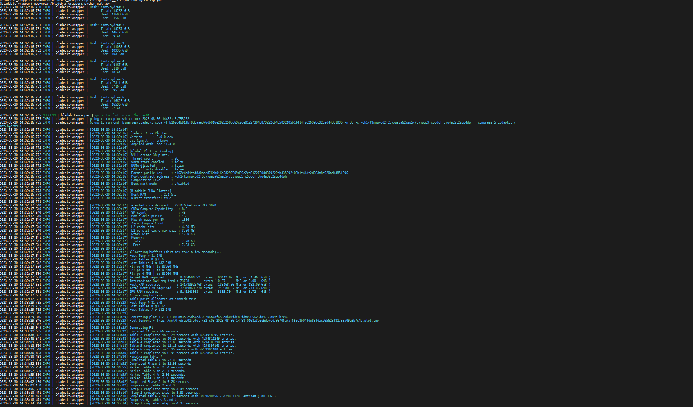

# bladebit wrapper

This wrapper will run bladebit_cuda and can take multiple path for destination. It will also delete plot if needed to replot a farm and ensure to maximise your farm size.

<div style="display: flex; align-items: center;">
  <a href="https://lafermedumineur.fr/chia-pool-stats/">
    
  </a>
  <a href="https://discord.gg/G6zN82jJdp">
    
  </a>
  <p>This code has been build with love by LFDM teams. If you want to join us, click us</p>

</div>

## Install

Ensure you have python & [git](https://git-scm.com/book/en/v2/Getting-Started-Installing-Git). then run in terminal

````shell
git clone https://github.com/CryptoLFDM/bladebit_wrapper.git
cd bladebit_wrapper
python3 -m venv .
source bin/activate
pip install requierement.txt
````

## disclaimer warning

We provide binaries build by ourself from [bladebit](https://github.com/Chia-Network/bladebit). We have choosen this for one main reason, we are using a special branch [cuda-windows-fix](https://github.com/Chia-Network/bladebit/tree/cuda-windows-fix) wich include plot support for 128Go/256Go in ram for Windows & Linux.
Once it will be merged, we will get it from [official chia repo](https://downloads.chia.net/).

feel free to build it by ourself if you want 😊

## Edit config file

there is a `config.yml` in `config` folder. Please edit and replace with your information otherwise you will create a plot for me 😏. Please keep in mind that compression level 6 or + need gpu for farming. 5 is the maximum for cpu.

mode plot is the mode to only plot

mode replot will do the plot mode, but once the wrapper will not be able to plot, it will detroy a single plot with a lower compression and then replot it. (currently not implemented)


````yaml
---
# mode can be:
# plot | will only plot until no more free space
# replot | will plot like plot, but if no space made, will remove plot file with lower compression level
mode: plot

farmer_key: b162c4b81fbf8d0aae876db016e28292509d69c2ce01227304d879222cb435092105b1f414f2d263a8c920ad44851096
contract_key: xch1tqlg956zauwf8tsljrafg5mwmnksrcgtzl9h6c9e9zrj27rrg0kqjm3gl3
compression_level: 5

directories_to_plot:
  - U:\
  - V:\
  - W:\
  - X:\
  - Y:\
  - Z:\

plot_with_128GO_ram_only: false
tmp_plot_directory_for_128go_ram_support: Z:\

````


❗Do not edit chia.yml, this file contains plot size information needed for space calculation. ❗

## Run it

in the same shell as above

````shell
python main.py
````

You will see log like




currently failling, only tested on my laptop with a poor amd gpu wich cannot handle it. I will replace it later

Wanna Join the pool ? https://lafermedumineur.fr/tutos-chia/rejoindre-la-pool/